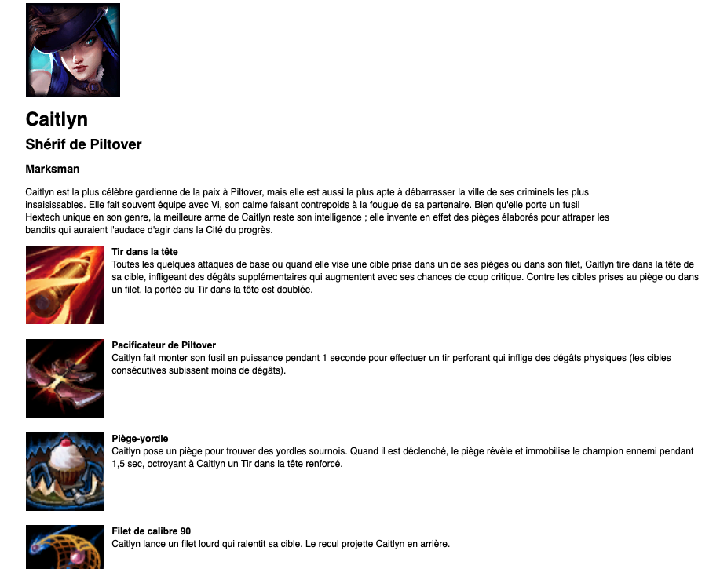

## 1. Description  

Ce site web nous permets d'avoir la liste complète des personnages du jeu vidéo League of Legends.  
Grâce à ce site, en cliquant sur un des peronnages présent sur la liste, une description du personnage est affiché.  
Nous voyons ainsi les compétences qu'il possède et ainsi la possibilité d'utiliser pendant une partie.  

## 2. Technologies
Ce projet est un site web basé sur du PHP, HTML, Css.
Il y'a une utilisation de l'api que nous pouvons retrouver sur ce site `https://developer.riotgames.com/docs/lol`.  

## 3. Utilisation  
Il est possible de le lancer sous Docker.  
Pour lancer le projet :  
  - Lancer un invite de commande  
  - docker build .  
  - docker run -t "nom image" .
  - docker run -p 20000:10000 -t "nom image" .
  - ecrire sur une page web "localhost"

## 4. Images  

## 4.1 Liste personnages    
  

## 4.2 Présentation personnage  
  
